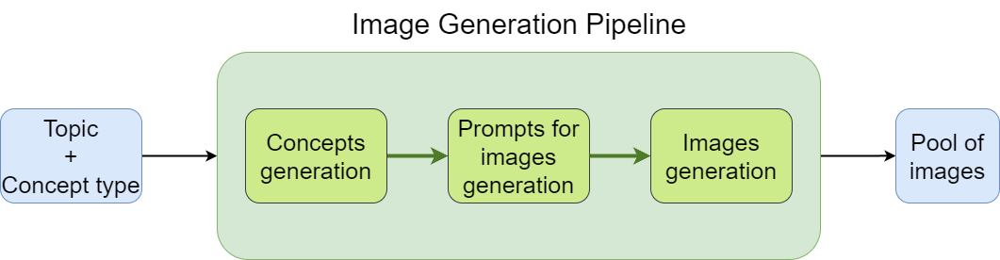

# Automatic image generation pipeline
This tool allows to generate images for various topics and concepts. See our [design doc](ml_system_design_doc/ML_System_Design_Doc_Image_Generation.md) (RU) for more details.  
By **topic** we mean the general domain to which images are related *(e.g. Innovations and technologies, Home Interior and Lifestyle, Nature and ecology)*    
By **concept** we mean what the images depict. We considered 3 types of concepts: *interiors, exteriors and items*, but this list can be broadened.



## How to use

Clone the repository, install requirements and load an image generation model:
```bash
git clone https://github.com/Aillustrate/wonderslide-interior-generation
pip install -r requirements.txt
  ```

Run via command line:
```bash
python main.py --topic=[TOPIC] --concept_type=[CONCEPT_TYPE]
```

Or in Python:
```python
# set your topic and concept type
topic = [your topic] #e.g. Innovations and technologies
concept_type = [concept_type] #e.g. interior

# initialize the pipeline
from aillustrate.pipelines import ParllelPipeline
pipeline = ParllelPipeline(topic, concept_type)

# start the generation process
pipeline.run()
```

Aso see the [notebook](https://github.com/Aillustrate/wonderslide-interior-generation/blob/main/notebooks/example.ipynb) with examples.
