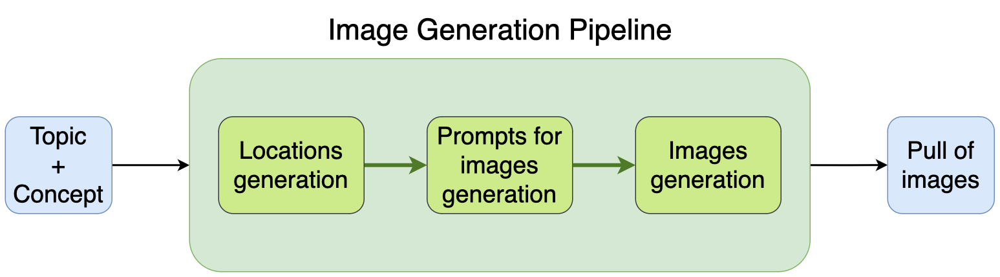

# ML System Design Doc
## Дизайн ML системы - Automatic image generation pipeline

> Работа над данным проектом ведется в сотрудничестве с [Wonderslide](https://wonderslide.com) – сервисом для генерации оформления для презентаций с помощью AI.

### 1. Цели и предпосылки 
#### 1.1. Зачем идем в разработку продукта?  

**Бизнес-цель:** Для оформления презентаций требуются разного рода изображения, в том числе изображения различных интерьеров и экстерьеров. При генерации оформления все картинки подбираются из внутреннего стока изображений. Основная цель данного проекта – пополнение данного стока сгенерированным контентом с помощью автоматического пайплайна.

**Почему станет лучше, чем сейчас, от использования ML:** В данный момент все картинки в стоке создаются "вручную". То есть все необходимые предметы и помещения в действительности фотографируются. Это сильно осложняет обеспечение разнообразия и объема контента в стоке. Сгенерированные же изображения решают данную проблему и не требуют ручного труда. Однако стандартные уже на данный момент инструменты для генерации предполагают написание промпта для каждого отдельного изображения. Автоматический же пайплайн предполагает, что данный процесс также возьмет на себя AI, а именно одна из существующих на данный момент LLM.

**Что будем считать успехом итерации с точки зрения бизнеса:** Требуется получить 10 тыс. хороших изображений, отражающих 13 различных тематик, таких как "Business and office", "Medicine and health", "Trainings and Education" и т.п. Среди данных изображений примерно 60% должны составлять интерьеры, 20% – экстерьеры и 20% – крупные планы предметов, относящихся к теме. Качество сгенерированного контента будет вручную оцениваться экспертами.

#### 1.2. Бизнес-требования и ограничения  

**Целевое решение:** Автоматический пайплайн для генерации изображений.

**Логика работы:**
- На вход в пайплайн подается общая тематика, на которую требуется сгенерировать изображения (например, "Business and office"), а также тип изображений, которые нужно получить (на данный момент рассматривается 3 типа: интерьеры - interiors, экстерьеры - exteriors и крупные планы предметов - items).
- На выходе получаем пулл с заданным количеством изображений.

**Бизнес-ограничения:**
- Необходимо разработать пайплайн, который затем можно будет перезапустить без участия разработчиков, для генерации изображений на новые тематики (не входящие в 13 выбранных заранее).
- Пайплайн желательно должен использовать open source решения как для генерации изображений, так и для работы с промптами к ним.

**Критерии успеха:** Критерием успеха служит позитивная обратная связь от эксперта, оценивающего сгенерированный контент на заранее обозначенные тематики.

**Возможные пути развития проекта:**
- Генерация других типов изображений не только интерьерного характера.
- Генерация изображений "на лету". То есть не пополнение стока за счет сгенерированного контента, а генерация непосредственно для конкретной презентации поданный в сервис.

#### 1.3. Что входит в скоуп проекта/итерации, что не входит   

**На закрытие каких БТ подписываемся в данной итерации:** 
- сбор информации от заказчиков (уточнение требований и ожиданий от результата), 
- определение алгоритма генерации изображений, выбор необходимых инструментов/моделей для его реализации, 
- подготовка кода пайплайна и документации к нему для понимания его работы и возможности перезапуска,
- подготовка пулла изображений на заданные тематики для пополнения стока.

**Результат с точки зрения качества кода и воспроизводимости решения:** Отдельный репозиторий со скриптами, составляющми паплайн, на Python, примерами работы и документацией.

#### 1.4. Предпосылки решения  

**Проблема:** В настоящий момент уходит много времени на "ручное" пополнение внутреннего стока изображений заказчика. Так, например, чтобы получить 500 различных изображений офисов, нужно реально обойти большое количество помещений и сделать снимки. Кроме того, в данный момент заказчики уже попробовали использовать стандартные решения для генерации, но это также потребовало времени и трудозатрат дизайнеров для написания промптов для генеративной сети. 

### 2. Методология     

#### 2.1. Постановка задачи  

Финальный результат проекта - автоматический пайплайн для генерации изображений.

#### 2.2. Этапы решения задачи 

**Этап 0. Сбор и уточнение требований к сгенерированным изображениям и пайплайну.**

Тематики и типы изображений для генерации, технические требования (какие модели можем использовать для работы с промптами и изображениями: open source или есть возможность использования платных API) и формальные требования к конечному оформлению решения.

**Этап 1. Разработка алгоритма генерации**

На первом этапе нужно продумать в целом **основные шаги, которые будет содержать пайплайн**. Предполагается, что он будет выглядеть следующем образом:

1. На вход LLM подается тематика (topic), на которую необходимо сгенерировать изображения, и тип изображений (concept), которые нужно получить (interior, exterior, items).
2. По сколько в данный момент мы работаем с изображениями интерьерного типа, на данном шаге LLM генерирует возможные локации, связанные с указанной тематикой.
3. Для каждой локации та же LLM генерирует несколько разнообразных промптов, описывающих то, как эта локация может выглядеть.
4. Данные промпты подаются в модель для генерации изображений.
5. На выходе мы получаем пулл с заданным количеством изображений на указанную тематику.

**Этап 2. Подбор и попытка развертки ML-моделей**

Поскольку пайплайн предполагает использования больших open source моделей как для работы с промптами (LLM), так и для генерации изображений, необходимо исследовать возможные решения для подбора оптимального варианта, который подойдем как с технической точки зрений (будет возможность развернуть и запустить его на имеющихся мощностях), так и с точки зрения качества.

Планируется попробовать различные версии [Llama-2](https://huggingface.co/meta-llama) и [Mistral](https://huggingface.co/mistralai) для работы с промптами и несколько дообученных на интерьеры версий [Stable Diffusion](https://stability.ai).

**Этап 3. Промпт-инжиниринг**

На каждом шаге использования LLM необходим свой системный промпт, чтобы она выдавала необходимые результаты, будь то список локаций или их описания. Требуется написать промпты, с которыми модель будет давать наиболее качественные ответы. Кроме того, для наиболее подробных и реалистичных описаний определенных помещений, например таких специфических как цеха или мастерские, в системные промпты необходимо будет вносить некоторые дополнительные подробности, связанные с конкретной тематикой. С этим также необходимо будет проэксперементировать и отразить затем в реализации пайплайна.

**Этап 4. Сборка пайплайна**

Подготовка скриптов, собирающих весь пайплайн воедино. Запуск пайплайна после этого будет оставлять импорт и запуск функции класса.

**Этап 5. Подготовка репозитория со всей необходимой документацией**

Результаты работы будут оформлены в GitHub репозиторий, в котором будут содержаться скрипты пайплайна, все необходимые дополнительные файлы с промптами, jupiter-ноутбук с примером использования инструмента и документация с пояснениями по использованию.

**Этап 6. Запуск пайплайна для генерации пулла изображений на оговоренные тематики**

Запуск подготовленного пайплайна для генерации пулла из 10 тыс. изображений, отражающих 13 различных тематик.

